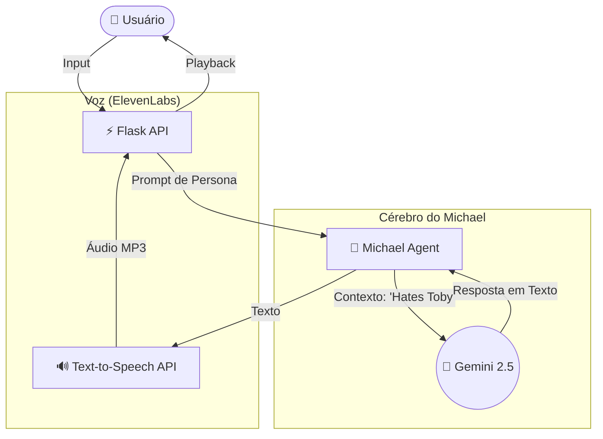
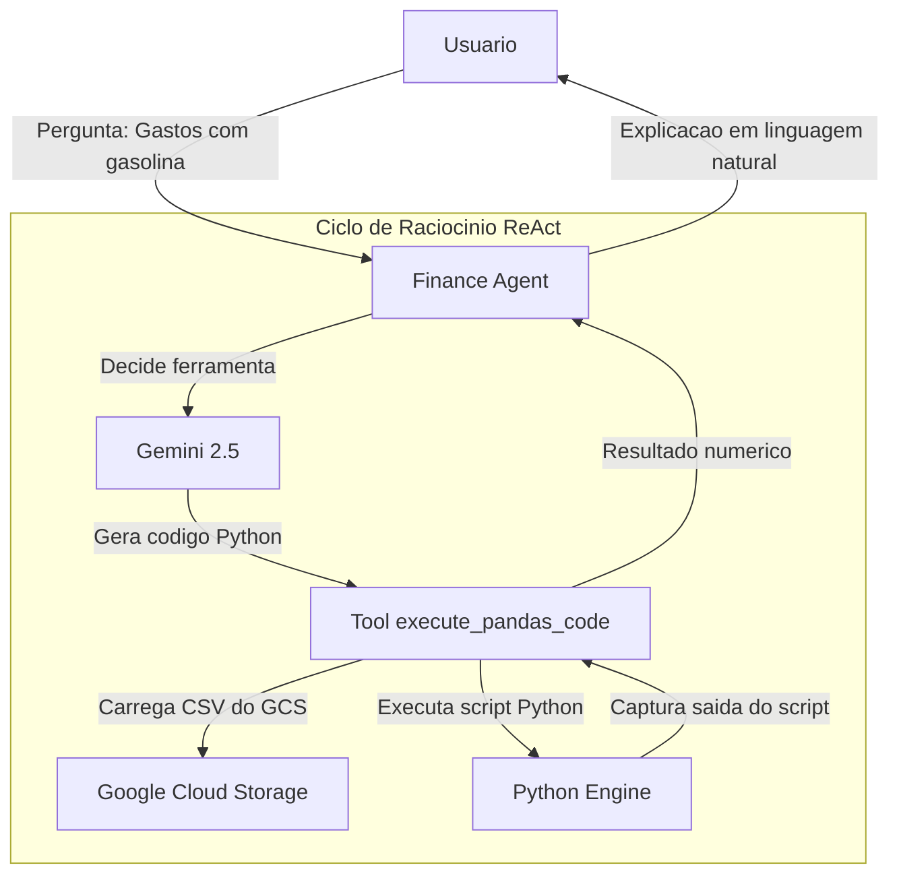
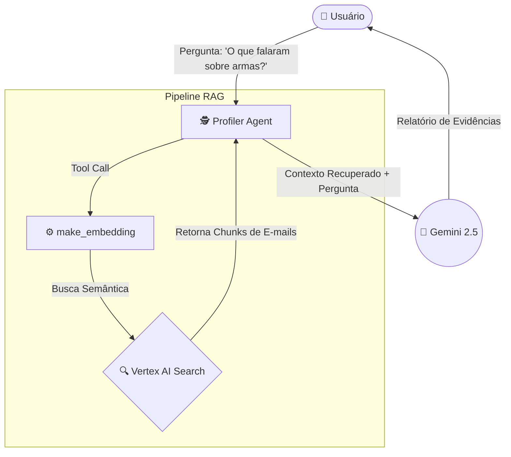
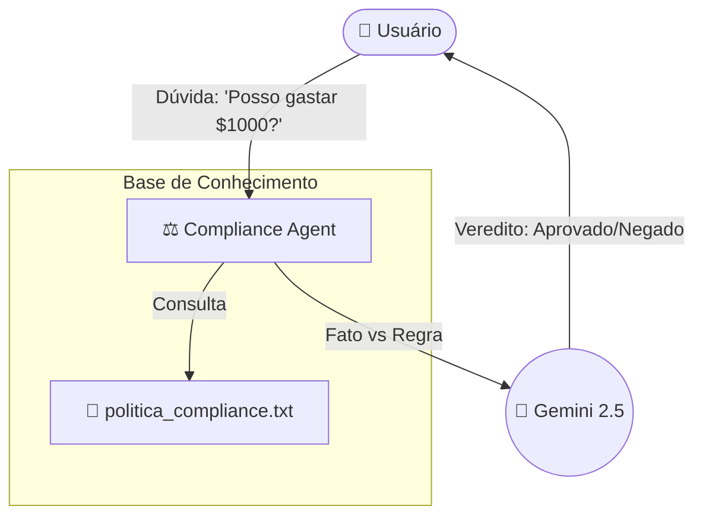
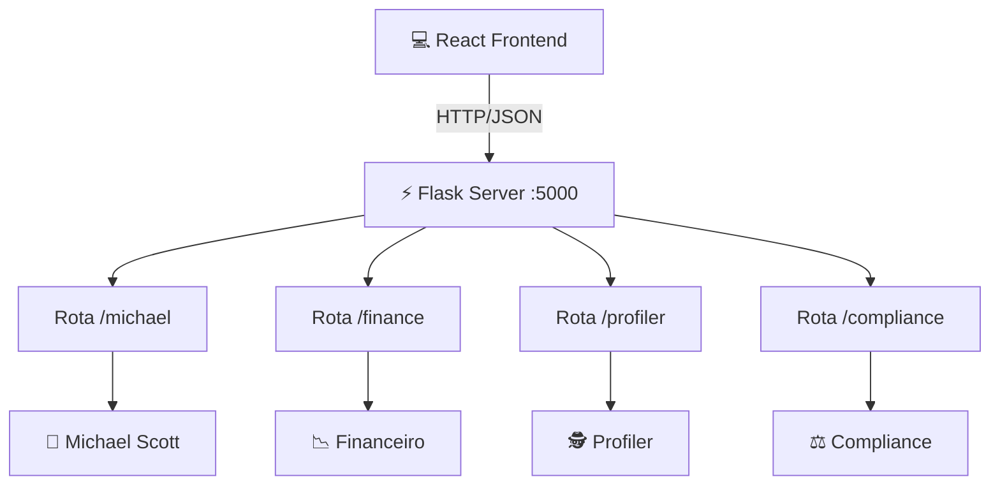

# 📄 Dunder AI - Auditoria Inteligente (ReadMe parcialmente gerado com Inteligência Artificial)

[:strip_icc()/i.s3.glbimg.com/v1/AUTH_08fbf48bc0524877943fe86e43087e7a/internal_photos/bs/2023/X/s/DtXUAyRLCB6hx8Xy5TRg/the-office-2.jpg)](https://youtube.com/seu-link-aqui)

> *"Limitless Paper in a Paperless World."*

A **Dunder AI** é um sistema de auditoria forense corporativa temático da série *The Office*. O projeto utiliza **Agentes de IA Generativa** orquestrados para analisar dados financeiros, e-mails corporativos e conformidade com regras, tudo encapsulado em uma interface nostálgica e "burocrática", gerenciada pela persona de Michael Scott.

---
### Acesse o sistema:
Além da execução local, detalhada mais adiante neste README, o Dunder AI também conta com um ambiente já publicado.
Isso significa que você pode explorar todas as funcionalidades do sistema diretamente pelo navegador, sem precisar instalar dependências ou configurar o ambiente na sua máquina.

Acesso: http://34.111.115.133/
---

## 🏗️ Arquitetura dos Agentes

Abaixo detalhamos a arquitetura lógica de cada componente do sistema utilizando o **Google Agent Development Kit (ADK)** e **Gemini**.

### 1. Michael Scott Persona (Chat + Voz)
Este agente não realiza trabalho técnico. Seu objetivo é manter a persona, fazer piadas inadequadas e gerar áudio via ElevenLabs.



### 2. Agente Financeiro (Python REPL & Pandas)
O "Oscar Martinez" do sistema. Ele é capaz de escrever e executar código Python para analisar arquivos CSV pesados.



### 3. Agente Profiler (RAG em E-mails)
O "Dwight Schrute" investigador. Usa RAG (Retrieval-Augmented Generation) para buscar evidências em e-mails não estruturados.



### 4. Agente Compliance (Verificação de Regras)
O "Toby Flenderson". Compara intenções do usuário contra o manual de política da empresa.


### 5. Visão Geral do Sistema (Orquestrador)



### Design do Frontend
O frontend foi desenvolvido com React + Vite e estilizado com Tailwind CSS.

Inspiração: O site da Dunder Mifflin (anos 2000), estética de papel timbrado, burocracia e minimalismo corporativo.

Elementos Chave:

Fontes Monoespaçadas (Courier New) simulando relatórios datilografados.

Contraste Preto e Branco (Tinta e Papel).

Menu lateral fixo estilo intranet antiga.

Feedback visual de "Carregando" piscante.

### Instalação e Configuração
Pré-requisitos
Python 3.10 ou superior.

Node.js 18 ou superior.

Conta no Google Cloud Platform (com Vertex AI ativado).

Conta na ElevenLabs (opcional, para voz).

#### 1. Configurando o Backend (ADK + Python)
Clone o repositório e navegue até a raiz.

Crie e ative o ambiente virtual:

```Bash

python -m venv venv
# Windows:
.\venv\Scripts\activate
# Linux/Mac:
source venv/bin/activate
```

Instale as dependências (incluindo o Google GenAI e ADK):

```Bash

pip install -r requirements.txt
```

Crie um arquivo .env na raiz do projeto com suas chaves:

```Bash
# Google Cloud & Gemini
GOOGLE_API_KEY="sua_chave_aqui"
PROJECT_ID="seu_project_id"
LOCATION="us-central1"

# Google Cloud Storage (Para o CSV financeiro)
BUCKET_NAME="nome_do_seu_bucket"
BLOB_NAME="data/transacoes_bancarias.csv"

# ElevenLabs (Voz do Michael)
ELEVENLABS_API_KEY="sua_chave_elevenlabs"
MICHAEL_VOICE_ID="ErXwobaYiN019PkySvjV"
```

#### 2. Configurando o Frontend
Abra um novo terminal e entre na pasta do front:

```Bash

cd dunder-frontend
```

Instale as dependências do Node:

```Bash
npm install
```

### Como Rodar:
Você precisará de dois terminais rodando simultaneamente.

Terminal 1: Backend API

```Bash

# Na raiz do projeto
python src/api/app.py
```

O servidor ficará online em http://localhost:5000. Documentação Swagger: http://localhost:5000/docs.

Terminal 2: Frontend

```Bash

# Na pasta dunder-frontend
npm run dev
```

Acesse a interface em http://localhost:5173.

### Guia de Testes (O que perguntar?)
#### Para o Michael:
> "Tell me a joke about Toby."

> "What is the meaning of life?"

#### Para o Financeiro (CSV):

> "Qual o total gasto em restaurantes?"

> "Quais foram os 3 maiores gastos do Michael Scott?"

#### Para o Profiler (E-mails):

> "O que o Dwight falou sobre segurança ou armas?"

> "Existe algum plano secreto mencionado nos e-mails?"

#### Para o Compliance:

> "Posso comprar bebidas alcoólicas com o cartão da empresa?"

> "É permitido gastar $1000 sem recibo?"

## Créditos
> [Fernando Soares de Oliveira](https://www.linkedin.com/in/fernando-soares-de-oliveira/)
> [Murilo Couto de Oliveira](https://www.linkedin.com/in/murilo-couto-oliveira/)
> [Ian Pereira Simão](https://www.linkedin.com/in/ian-pereira-simao/)

"I am Beyoncé, always." - Grande Michael Scott
